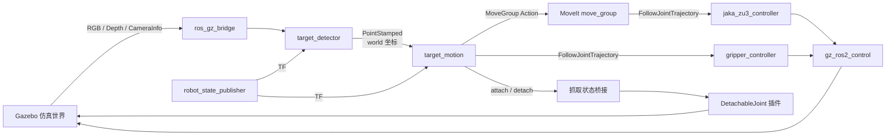
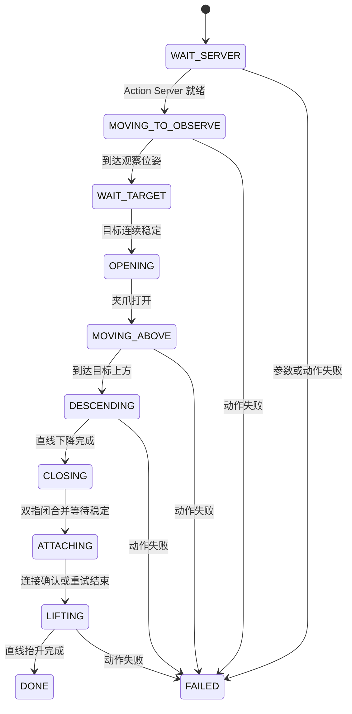

# JAKA ZU3 视觉抓取项目总结与面试准备

## 1. 项目一句话介绍

本项目基于 ROS 2 Humble、Gazebo、MoveIt 2、OpenCV 和 RGB-D 相机，实现了 JAKA ZU3 六轴机械臂对红色目标的三维定位、运动规划、二指夹爪闭合和抬升抓取，并针对 RGB-D 同步、目标抖动、动作超时和 Gazebo 抓取不稳定等问题增加了保护逻辑。

简历上可以将项目命名为：

> 基于 ROS 2 与 RGB-D 视觉的 JAKA ZU3 机械臂自主抓取系统

## 2. 系统总体架构



主要数据链路如下：

1. Gazebo 中的腕部 RGB-D 相机发布彩色图、深度图和相机内参。
2. `target_detector` 分割红色目标，计算目标像素中心和目标区域深度。
3. 使用针孔相机模型将二维像素恢复为相机坐标系三维点。
4. 使用 TF2 将目标点从 `camera_optical_frame` 转换到 `world`。
5. `target_motion` 对连续目标点进行稳定性判断，然后依次执行观察、预抓取、下降、闭合和抬升。
6. 机械臂轨迹由 MoveIt 2 规划，夹爪轨迹直接发送给 `gripper_controller`。
7. Gazebo 中使用可分离关节作为抓取承载的仿真补偿，避免仅依赖接触摩擦导致物体滑落。

## 3. 本项目新增或修改的文件

| 文件 | 主要作用 | 本次工作的重点 |
| --- | --- | --- |
| `src/jaka_description/urdf/jaka_zu3_tools.xacro` | 定义相机和二指夹爪工具宏 | 相机模型、夹爪结构、双指运动方向、Gazebo 条件配置 |
| `src/jaka_zu3_moveit_config/config/jaka_zu3.urdf.xacro` | 组装完整机器人模型 | 调用工具宏、加载控制插件和 Gazebo 抓取插件 |
| `src/jaka_zu3_moveit_config/launch/demo_gazebo.launch.py` | 启动整个仿真系统 | 启动顺序、桥接、参数、MoveIt、控制器和视觉节点 |
| `src/jaka_zu3_vision/jaka_zu3_vision/target_detector.py` | RGB-D 目标检测和三维定位 | 图像同步、红色分割、稳健深度、相机反投影、TF 变换 |
| `src/jaka_zu3_vision/jaka_zu3_vision/target_motion.py` | 抓取状态机和动作执行 | 目标稳定过滤、MoveIt Action、夹爪 Action、超时和抓取连接 |
| `src/jaka_zu3_vision/config/vision_grasp.yaml` | 视觉与抓取参数集中配置 | 将阈值、距离、速度和安全范围从代码中分离 |
| `src/jaka_zu3_vision/package.xml` | ROS 2 包依赖声明 | 增加 OpenCV、NumPy、消息和控制相关依赖 |
| `src/jaka_zu3_vision/setup.py` | Python 包安装配置 | 安装 YAML 参数文件并注册可执行节点 |
| `src/jaka_zu3_vision/test/test_target_processing.py` | 核心算法单元测试 | 深度中值、分辨率适配、三维中值和距离计算 |
| `README.md` | 项目使用说明 | 增加构建、运行、参数和抓取功能说明 |

下面逐个说明这些文件。

## 4. 文件级修改说明

### 4.1 `jaka_zu3_tools.xacro`

路径：`src/jaka_description/urdf/jaka_zu3_tools.xacro`

这个文件用于把末端工具从机械臂主体模型中独立出来，通过 Xacro 宏按需装配。它主要包含两个宏。

#### `jaka_zu3_camera` 宏

主要定义：

- `camera_link`：相机实体、惯量、可视模型和碰撞模型。
- `camera_joint`：相机与机械臂 `Link_6` 的固定连接。
- `camera_optical_frame`：符合相机光学坐标约定的坐标系。
- RGB 相机和深度相机 Gazebo Sensor。
- 图像分辨率、视场角、更新频率、近远裁剪距离和发布话题。

宏参数：

- `parent`：相机安装在哪个机器人 Link 上。
- `use_gazebo`：是否生成 Gazebo Sensor 配置。
- `enable_camera_sensor`：是否真正启用相机渲染和数据发布。

你需要理解，`camera_link` 是机械安装坐标系，而 `camera_optical_frame` 是视觉算法使用的光学坐标系。常见光学坐标约定是：

- X 轴向图像右侧；
- Y 轴向图像下方；
- Z 轴沿镜头视线向前。

#### `jaka_zu3_parallel_gripper` 宏

主要定义：

- `gripper_base_link`：夹爪基座。
- `gripper_base_joint`：夹爪与 `Link_6` 的固定关节。
- `left_finger_link`、`right_finger_link`：左右手指。
- `left_finger_joint`、`right_finger_joint`：两个移动副关节。
- `gripper_tcp`：工具中心点标记。

双指对称运动的关键不是给两个关节一正一负的位置，而是：

```xml
<axis xyz="0 -1 0"/>  <!-- 左指 -->
<axis xyz="0  1 0"/>  <!-- 右指 -->
```

两个关节接收相同的正位置值，因为关节轴方向相反，所以它们会同时向中间移动。

当前零位时夹爪内侧开口约为 70 mm。目标方块宽度是 50 mm，每个手指移动 10 mm 后理论开口为：

```text
70 mm - 10 mm - 10 mm = 50 mm
```

因此配置中的 `closed_width` 设置为 `0.010 m`。

Gazebo 中曾出现一侧手指先碰到偏心物体后被物理约束卡住，而另一侧继续运动的问题。当前方案通过 `use_gazebo` 条件，在 Gazebo 中不生成手指碰撞体，使两侧表现为理想对称联动；非 Gazebo 模式仍保留碰撞模型。物体承载由闭合后的 DetachableJoint 完成。

这里要明确：这是为了稳定演示而采用的仿真工程方案，不等同于真实夹爪的力控制或接触建模。

### 4.2 `jaka_zu3.urdf.xacro`

路径：`src/jaka_zu3_moveit_config/config/jaka_zu3.urdf.xacro`

这个文件是完整机器人描述的装配入口，作用类似“总装图”。

主要修改：

1. 引入 `jaka_zu3_tools.xacro`。
2. 调用 `jaka_zu3_camera`，把相机安装到 `Link_6`。
3. 调用 `jaka_zu3_parallel_gripper`，把夹爪安装到 `Link_6`。
4. 把 `use_gazebo` 参数传给工具宏，实现仿真和非仿真模型差异化。
5. 加载 `gz_ros2_control` 插件，使 Gazebo 关节能够被 ROS 2 控制器驱动。
6. 增加 `enable_grasp_attachment` 参数，按需加载 DetachableJoint 插件。

DetachableJoint 的配置含义：

```xml
<parent_link>Link_6</parent_link>
<child_model>target_cube</child_model>
<child_link>link</child_link>
```

它会在收到 attach 命令后，在机械臂末端和目标方块之间建立固定连接；收到 detach 命令后解除连接。
DetachableJoint 是 Gazebo 中用于仿真抓取稳定性的可动态固定连接插件，抓取后临时把目标物体固定到机械臂末端，避免仅依靠接触摩擦时出现滑落或仿真不稳定；它不等同于真实夹爪的力学抓取。
对应话题为：

- `/gripper/attach`
- `/gripper/detach`
- `/gripper/attached`

该插件只在 `use_gazebo=true` 且 `enable_grasp_attachment=true` 时加载，不应直接用于真实机械臂。

### 4.3 `demo_gazebo.launch.py`

路径：`src/jaka_zu3_moveit_config/launch/demo_gazebo.launch.py`

这个文件不是简单地“启动几个节点”，而是在协调一个有依赖关系的系统。

#### 启动参数

| 参数 | 含义 |
| --- | --- |
| `enable_camera` | 是否启用相机 Sensor、图像桥接和检测节点 |
| `run_grasp` | 是否启动视觉抓取流程 |
| `execute_grasp` | `false` 只规划，`true` 才真正执行 |
| `headless` | 是否只运行 Gazebo Server，不打开 GUI |
| `use_rviz` | 是否启动 RViz |
| `vision_params_file` | 指定视觉抓取 YAML 参数文件 |

#### 启动的核心组件

- Gazebo Server/GUI；
- `robot_state_publisher`；
- Gazebo 中的机器人实体；
- `/clock` 桥接；
- RGB、Depth 和 CameraInfo 桥接；
- 抓取 attach/detach 状态桥接；
- ros2_control 控制器；
- MoveIt `move_group`；
- RViz；
- `target_detector`；
- `target_motion`。

#### 为什么需要控制启动顺序

系统按照下面的依赖顺序启动：

```text
Gazebo + robot_state_publisher
        ↓
在 Gazebo 中生成机器人
        ↓
加载并激活 joint_state_broadcaster、机械臂控制器、夹爪控制器
        ↓
启动 MoveIt、RViz 和 target_motion
```

如果 MoveIt 或抓取节点启动太早，可能发生：

- Action Server 尚未就绪；
- 控制器还未激活；
- TF 树不完整；
- 第一个目标被拒绝；
- Gazebo 初始化相机渲染时阻塞控制器加载。

因此代码使用 `OnProcessExit` 和 `TimerAction` 控制顺序，并让 `target_motion` 延迟 8 秒启动。

#### ROS 与 Gazebo 桥接方向

抓取插件使用以下桥接：

```text
/gripper/attach   ROS Empty  → Gazebo Empty
/gripper/detach   ROS Empty  → Gazebo Empty
/gripper/attached Gazebo StringMsg → ROS String
```

需要特别记住：DetachableJoint 的状态不是布尔值，而是字符串 `attached` 或 `detached`。项目曾因为把它错误桥接为 `Boolean`，导致状态机一直等待回执，机械臂完全不动。这个问题很适合作为面试中的调试案例。

### 4.4 `target_detector.py`

路径：`src/jaka_zu3_vision/jaka_zu3_vision/target_detector.py`

该节点负责从 RGB-D 数据得到 `world` 坐标系中的目标三维点。

#### 输入和输出

输入：

- `/wrist_camera/rgb_image`
- `/wrist_camera/depth_image`
- `/wrist_camera/camera_info`
- TF 树

输出：

- `/detected_target_point`：`geometry_msgs/PointStamped`
- `/detected_target_marker`：RViz 可视化球形 Marker

#### RGB-D 时间匹配

节点保留最近 5 帧深度图。每收到一帧 RGB 图像，就查找时间戳最接近的深度帧，并检查时间差是否小于 `max_rgb_depth_delta`。

这么做是因为 RGB 和 Depth 分别发布时，“最新 RGB + 最新 Depth”不一定属于同一时刻。机械臂或相机运动时，不同步会直接造成像素与深度错配。

订阅使用 `qos_profile_sensor_data`，适合高频传感器数据，其目标是低延迟而不是保证每一帧都可靠送达。

#### 红色目标分割

处理步骤：

1. 使用 `cv_bridge` 将 ROS Image 转为 OpenCV 图像。
2. BGR 转 HSV。
3. 使用两个 Hue 区间提取红色。
4. 形态学开运算去除小噪声。
5. 形态学闭运算填补目标内部空洞。
6. 提取外轮廓。
7. 根据 `min_area` 和 `max_area` 过滤轮廓。
8. 选取面积最大的有效轮廓。
9. 使用图像矩计算轮廓中心 `(u, v)`。

红色需要两个 Hue 区间，是因为 OpenCV HSV 中红色位于 Hue 环的两端，大致分布在 `0~10` 和 `170~179`。

#### 稳健深度估计

项目不是只读取中心像素深度，而是：

1. 把目标轮廓填充成 Mask；
2. 腐蚀一次边缘，减少背景像素影响；
3. 适配 RGB 与 Depth 分辨率不同的情况；
4. 过滤 0、NaN 和 Inf；
5. 使用目标区域有效深度的中位数；
6. 同时支持浮点米制深度和 `uint16` 毫米深度。

使用中位数的原因是它对少量异常值、空洞和背景混入不敏感，比单点值或均值更稳定。

#### 像素反投影到三维坐标

根据相机内参：

```text
X = (u - cx) × Z / fx
Y = (v - cy) × Z / fy
Z = depth
```

其中：

- `(u, v)` 是目标像素中心；
- `(fx, fy)` 是焦距；
- `(cx, cy)` 是主点；
- `Z` 是目标深度。

节点优先使用 `CameraInfo.K`，并根据实际图像尺寸缩放内参。如果 CameraInfo 暂时不可用，则通过图像宽度和水平视场角计算备用焦距：

```text
f = width / (2 × tan(horizontal_fov / 2))
```

#### TF 坐标变换

相机坐标系中的三维点通过 TF2 转换到 `world`：

```text
camera_optical_frame → ... → Link_6 → ... → base/world
```

Gazebo 图像时间有时会比关节状态 TF 快一个仿真周期，严格按图像时间查询会产生 future extrapolation。项目允许使用最新 TF，避免静态目标场景下持续查询失败。

这里需要理解：项目没有在检测代码里手工叠加相机安装偏移，而是让 URDF/TF 树统一维护坐标关系。

### 4.5 `target_motion.py`

路径：`src/jaka_zu3_vision/jaka_zu3_vision/target_motion.py`

该节点负责判断目标是否可靠，并执行完整抓取动作。

#### 抓取状态机



#### 目标安全判断

抓取前会检查：

- 消息坐标系必须是配置的 `target_frame`；
- 坐标必须是有限数；
- 目标必须位于工作空间边界内；
- 目标时间戳不能过旧；
- 连续多次检测的三维距离必须小于稳定阈值；
- 最终位置使用连续点的逐坐标中位数。

这部分的意义是避免单帧误检直接触发机械臂动作。

#### MoveIt 规划

节点通过 `moveit_msgs/action/MoveGroup` 直接构造 Action Goal。

使用的约束包括：

- `JointConstraint`：观察位姿 `POSE_1`；
- `PositionConstraint`：末端位置允许误差；
- `OrientationConstraint`：保持抓取方向。

规划器选择：

- 观察位姿、预抓取：Pilz `PTP`；
- 垂直下降、垂直抬升：Pilz `LIN`。

选择 LIN 的原因是抓取最后阶段应尽量沿直线接近和离开目标，减少横向扫碰。PTP 更适合关节空间中的大范围快速移动。

`execute_motion=false` 时只进行规划验证；`true` 时才执行轨迹。这是一个重要的安全设计。

#### 二指夹爪控制

夹爪使用 `control_msgs/action/FollowJointTrajectory`：

```python
goal.trajectory.joint_names = [
    'left_finger_joint', 'right_finger_joint'
]
point.positions = [width, width]
```

由于 URDF 中两个关节轴相反，相同的 `width` 会让手指向中间移动。

节点还订阅 `/joint_states`，在闭合后记录左右手指位置，并检查：

- 左右手指位置差是否在 `finger_sync_tolerance` 内；
- 每个手指是否接近目标闭合位置。

当前 Gazebo 模式下，同步异常会记录警告，但不会阻断后续连接和抬升。

#### Action 超时与错误处理

机械臂和夹爪 Action 共用一套封装逻辑：

- 检查 Goal 是否被接受；
- 异步等待结果；
- 解析 MoveIt 或控制器错误码；
- 到达 `action_timeout` 后取消 Goal；
- 确保回调只结束一次；
- 失败时进入 `FAILED`，清理定时器和仿真连接。

这比只发送 Action、不检查返回结果更适合工程项目。

#### Gazebo 抓取连接

Gazebo 中仅靠摩擦力夹住小方块容易出现滑落、穿模或物体不随夹爪抬升。当前流程为：

1. 节点启动时重复发布 detach，确保目标没有提前绑定到机械臂。
2. 夹爪下降并闭合。
3. 发布 attach。
4. 读取字符串状态 `attached` / `detached`。
5. 收到 `attached` 后开始抬升。
6. 如果状态回执异常，短时间重复发布 attach，随后继续执行，避免状态机永久卡死。

这属于仿真补偿。真实机械臂需要根据实际夹爪协议、电流/力反馈、物体检测或真空压力判断抓取是否成功。

### 4.6 `vision_grasp.yaml`

路径：`src/jaka_zu3_vision/config/vision_grasp.yaml`

该文件将易调整参数从 Python 代码中分离。

参数可以分为五组：

1. 话题和坐标系：RGB、Depth、CameraInfo、目标点、Marker、`world`、相机坐标系。
2. 视觉阈值：HSV 饱和度/亮度、轮廓面积、深度范围、最少深度像素数。
3. 抓取几何：预抓取高度、抓取高度、抬升高度、夹爪开闭位置。
4. 规划参数：规划管线、PTP/LIN、速度和加速度缩放。
5. 安全参数：目标最大年龄、稳定次数、稳定距离、工作空间和 Action 超时。

需要理解 ROS 2 参数优先级：代码中的 `declare_parameter` 是默认值，YAML 会覆盖默认值，Launch 中直接传入的参数又可以覆盖 YAML。

例如：

- 代码中 `use_sim_attachment` 默认是 `false`；
- YAML 中仍保持 `false`；
- Gazebo 抓取 Launch 启动 `target_motion` 时将它覆盖为 `true`。

这样同一个节点可以复用于仿真和真实硬件。

### 4.7 `package.xml`

路径：`src/jaka_zu3_vision/package.xml`

主要修改：

- 补充包描述和 BSD-3-Clause License；
- 声明 `std_msgs`；
- 声明 `python3-numpy`；
- 声明运行时 OpenCV；
- 保留 TF2、MoveIt、控制器消息、轨迹消息和可视化消息依赖。

面试时要知道：`package.xml` 是 ROS 包的依赖和元数据声明，不等同于 Python 的 `import` 列表，也不等同于 `setup.py`。

### 4.8 `setup.py`

路径：`src/jaka_zu3_vision/setup.py`

主要修改：

- 把 `config/vision_grasp.yaml` 安装到包的 Share 目录；
- 完善包描述和 License；
- 保留两个 Console Script：
  - `target_detector`
  - `target_motion`

Console Script 让节点可以通过下面的方式运行：

```bash
ros2 run jaka_zu3_vision target_detector
ros2 run jaka_zu3_vision target_motion
```

如果 YAML 没有通过 `data_files` 安装，`FindPackageShare("jaka_zu3_vision")` 就可能找不到配置文件。

### 4.9 `test_target_processing.py`

路径：`src/jaka_zu3_vision/test/test_target_processing.py`

当前测试覆盖：

- 深度图中存在背景 0 和异常远点时，中位数仍能得到正确深度；
- RGB 和 Depth 分辨率不同时，Mask 能正确缩放；
- 连续三维点含离群值时，中位数坐标保持稳定；
- 三维稳定性判断使用欧氏距离。

这些测试针对的是纯数据处理函数，不需要启动 Gazebo，运行快，也便于定位算法回归问题。

### 4.10 `README.md`

根目录 README 增加了：

- Guarded Visual Picking 功能概述；
- 构建命令；
- 只规划和实际执行两种启动命令；
- Headless/RViz 选项；
- 常用参数说明；
- 双指相反轴和仿真抓取连接的说明。

## 5. 需要同时理解的关联文件

下面这些文件不一定出现在本轮 Git 修改列表中，但它们决定系统能否真正工作。

### `jaka_rgbd_world.sdf`

路径：`src/jaka_zu3_moveit_config/config/jaka_rgbd_world.sdf`

定义 Gazebo 世界、地面、光源和 `target_cube`。当前目标是边长 50 mm、质量 0.05 kg 的红色动态方块。

### `jaka_zu3.ros2_control.xacro`

路径：`src/jaka_zu3_moveit_config/config/jaka_zu3.ros2_control.xacro`

给六个机械臂关节和两个夹爪关节声明：

- position command interface；
- position state interface；
- velocity state interface；
- Gazebo 或 Mock Hardware 插件。

URDF 中有一个关节，并不代表 ROS 2 控制器自动能控制它；它还必须出现在 `<ros2_control>` 中。

### `ros2_controllers.yaml`

路径：`src/jaka_zu3_moveit_config/config/ros2_controllers.yaml`

定义：

- `joint_state_broadcaster`；
- 六轴 `jaka_zu3_controller`；
- 双指 `gripper_controller`。

机械臂和夹爪控制器都是 `JointTrajectoryController`，通过 position command interface 驱动 Gazebo 关节。

### `moveit_controllers.yaml`

路径：`src/jaka_zu3_moveit_config/config/moveit_controllers.yaml`

告诉 MoveIt：规划结果应该发送给哪个 FollowJointTrajectory Action，以及每个控制器负责哪些关节。

### `jaka_zu3.srdf`

路径：`src/jaka_zu3_moveit_config/config/jaka_zu3.srdf`

定义 MoveIt 语义信息，例如：

- 机械臂 Planning Group；
- 夹爪 Group；
- End Effector；
- 禁用的相邻 Link 碰撞对。

URDF 描述“机器人是什么结构”，SRDF 描述“MoveIt 应该怎样理解和规划这个机器人”。

## 6. 一次完整抓取的运行流程

1. Launch 解析参数并通过 Xacro 生成 `robot_description`。
2. Gazebo 加载世界，`robot_state_publisher` 发布机器人 TF。
3. `ros_gz_sim create` 将 JAKA ZU3 模型生成到 Gazebo。
4. `controller_manager` 加载并激活关节状态、机械臂和夹爪控制器。
5. 启动 MoveIt `move_group`。
6. 图像桥接把 Gazebo RGB-D 数据转换为 ROS 2 消息。
7. `target_motion` 先向抓取插件发送 detach，并等待 Action Server。
8. MoveIt 将机械臂运动到固定观察位姿。
9. `target_detector` 同步 RGB-D，检测红色轮廓并估计三维位置。
10. TF2 将相机坐标点转换到 `world`，发布 `/detected_target_point`。
11. `target_motion` 收集连续稳定目标点并计算中值。
12. 夹爪打开。
13. PTP 运动到目标上方 `approach_offset_z`。
14. LIN 直线下降到 `grasp_offset_z`。
15. 左右夹爪同时移动到 `closed_width`。
16. 检查 `/joint_states` 中的双指位置。
17. Gazebo 模式发送 attach，将方块连接到机械臂末端。
18. LIN 直线抬升到 `lift_offset_z`。
19. 状态进入 `DONE`，输出 `Pick sequence completed.`。

## 7. 应该掌握的知识点

如果这个项目写进简历，至少要能独立解释下面内容。

### 第一优先级：必须能讲清楚

1. ROS 2 Topic、Action、Parameter、Launch 的区别和本项目分别在哪里使用。
2. URDF/Xacro 中 Link、Joint、Origin、Axis、Limit 的含义。
3. 为什么左右夹爪使用相反 Axis，却发送相同的位置命令。
4. RGB-D 如何从像素和深度得到三维点。
5. `camera_optical_frame` 到 `world` 的 TF 变换链。
6. 为什么视觉结果要做时间同步、中值深度和连续稳定过滤。
7. MoveIt 中 PTP 与 LIN 的用途。
8. `ros2_control`、Controller Manager、JointTrajectoryController 的关系。
9. 抓取状态机每个状态的进入条件和失败处理。
10. Gazebo 中物体为什么可能夹住却抬不起来，以及当前仿真补偿方案。

### 第二优先级：面试加分项

1. Sensor Data QoS 为什么更适合图像。
2. Action Goal 接受、执行结果、超时和取消的异步流程。
3. CameraInfo 内参缩放和 FOV 备用内参计算。
4. HSV 红色为什么需要两个 Hue 区间。
5. 图像形态学开运算和闭运算的区别。
6. 为什么用中位数而不是单像素或均值深度。
7. MoveIt PositionConstraint 和 OrientationConstraint 如何构造。
8. 工作空间限制和目标时间戳为什么属于安全保护。
9. ROS-Gazebo 消息桥接方向和消息类型必须完全一致。
10. 仿真接触、摩擦、碰撞模型与真实夹爪之间的差异。

## 8. 建议重点准备的面试问题

### 你负责了项目的哪部分？

可以回答：

> 我在 JAKA 官方 ROS 2 工程基础上扩展了腕部 RGB-D 相机和二指夹爪模型，补充 ros2_control 与 MoveIt 控制链，开发 RGB-D 目标检测节点和抓取状态机，并解决了图像不同步、TF 时间外推、夹爪单边运动以及 Gazebo 中物体无法稳定抬升等问题。

### 视觉定位是怎样实现的？

回答顺序：HSV 分割 → 轮廓过滤 → 目标区域深度中位数 → 相机内参反投影 → TF2 转换到 world → 发布 PointStamped。

### 为什么不直接读取轮廓中心的深度？

中心像素可能为空洞、噪声或被背景污染。使用腐蚀后的目标区域中位数，对异常值更稳健。

### 为什么抓取前需要连续多帧稳定？

单帧误检可能造成危险动作。连续点的距离约束和中值过滤可以减少抖动和离群点影响。

### 为什么下降和抬升使用 LIN？

抓取附近需要笛卡尔直线运动，避免末端横向扫过物体；远距离预抓取则可用 PTP 提高效率。

### 为什么曾经机械臂完全不动？

DetachableJoint 实际发布 `StringMsg`，内容是 `attached/detached`，曾错误桥接为 Boolean，导致状态机等待不到回执。通过检查插件消息类型和桥接日志定位并修正，同时取消了非必要的永久硬等待。

### 为什么曾经只有一个手指移动？

日志显示左指位置保持 0、右指到达目标位置。原因是仿真中偏心物体先与一侧发生接触，该侧被碰撞约束卡住，而位置控制器仍认为轨迹结束。当前 Gazebo 演示使用理想对称运动，并在闭合后建立物体连接；真实系统则应使用机械联动夹爪或力/电流反馈。

### 为什么不把 Gazebo attach 当成真实抓取？

attach 是仿真稳定性补偿，只能说明抓取流程和控制逻辑已经贯通，不能代表真实接触力、摩擦和抓取稳定性。真实部署需要夹爪驱动、力反馈和抓取成功检测。

## 9. 简历表述示例

项目名称：**基于 ROS 2 与 RGB-D 视觉的 JAKA ZU3 机械臂自主抓取系统**

项目描述可以写成：

- 基于 ROS 2 Humble、Gazebo 和 MoveIt 2 搭建 JAKA ZU3 机械臂视觉抓取仿真平台，扩展腕部 RGB-D 相机与双指平行夹爪 URDF/Xacro 模型，并完成 ros2_control 控制链集成。
- 使用 OpenCV 完成红色目标 HSV 分割、形态学去噪和轮廓筛选，结合目标区域深度中位数、相机内参反投影与 TF2 坐标变换，输出世界坐标系下的三维目标位置。
- 设计观察、目标稳定判断、预抓取、直线下降、夹爪闭合和直线抬升状态机，通过 MoveGroup Action 和 FollowJointTrajectory Action 完成机械臂与夹爪协同控制。
- 针对 RGB-D 时间错配、TF 时间外推、动作服务启动竞争和 Gazebo 接触抓取不稳定问题，实现传感器 QoS、时间匹配、Action 超时、启动编排及仿真抓取连接机制。

不要写成：

> 实现了高精度工业级任意物体抓取。

因为当前项目仍是固定颜色目标、固定俯视抓取方向和 Gazebo 仿真抓取，应该诚实描述边界。

## 10. 项目当前局限与可继续扩展方向

当前局限：

- 目标检测依赖红色 HSV 阈值，不能识别通用物体。
- 只输出目标中心点，没有估计物体姿态和抓取角度。
- 抓取策略以固定俯视姿态为主。
- Gazebo 抓取使用 DetachableJoint，不是完整接触动力学。
- 没有实现放置、松爪和重复抓取循环。
- 尚未接入真实夹爪状态、电流或力反馈。

建议后续扩展优先级：

1. 增加放置位姿、松爪和 detach，形成 Pick-and-Place 闭环。
2. 使用轮廓最小外接矩形或点云 PCA 估计目标朝向。
3. 将颜色分割替换为 YOLO/实例分割，并保留深度反投影部分。
4. 使用点云估计表面法向和抓取姿态。
5. 增加 MoveIt Planning Scene 障碍物和碰撞物体。
6. 接入真实 JAKA 和真实夹爪驱动，加入急停、速度限制和抓取反馈。
7. 系统化记录成功率、定位误差和抓取耗时，而不是只展示单次成功。

## 11. 建议的掌握顺序

可以按下面顺序复习源码：

1. 先看 `jaka_zu3_tools.xacro`，理解相机和夹爪结构。
2. 再看 `jaka_zu3.urdf.xacro`，理解完整模型如何组装。
3. 看 `jaka_zu3.ros2_control.xacro` 和 `ros2_controllers.yaml`，理解关节如何被控制。
4. 看 `demo_gazebo.launch.py`，画出节点启动顺序。
5. 看 `target_detector.py`，手写一遍像素反投影公式和处理流程。
6. 看 `target_motion.py`，画出状态机并理解每个 Action 回调。
7. 看 `vision_grasp.yaml`，说明每个关键参数改变后会产生什么影响。
8. 最后准备三个故障案例：TF 时间错误、抓取状态消息类型错误、单侧夹爪碰撞卡住。

## 12. 构建与运行

构建：

```bash
cd ~/jaka_ws
source /opt/ros/humble/setup.bash
colcon build --symlink-install
source install/setup.bash
```

只规划观察位姿：

```bash
ros2 launch jaka_zu3_moveit_config demo_gazebo.launch.py \
  enable_camera:=true run_grasp:=true execute_grasp:=false
```

执行完整抓取：

```bash
ros2 launch jaka_zu3_moveit_config demo_gazebo.launch.py \
  enable_camera:=true run_grasp:=true execute_grasp:=true
```

无 Gazebo GUI、无 RViz：

```bash
ros2 launch jaka_zu3_moveit_config demo_gazebo.launch.py \
  enable_camera:=true run_grasp:=true execute_grasp:=true \
  headless:=true use_rviz:=false
```

## 13. 演示前检查清单

- 确认只启动了一套 Gazebo、MoveIt 和控制器，避免重复 Action Server。
- 确认 `/clock`、RGB、Depth、CameraInfo 和 `/joint_states` 都在发布。
- 确认 TF 中存在 `world` 到 `camera_optical_frame`。
- 确认 `joint_state_broadcaster`、`jaka_zu3_controller`、`gripper_controller` 为 active。
- 确认目标点位于 YAML 配置的工作空间内。
- 首次演示先使用 `execute_grasp:=false` 验证规划，再开启实际执行。
- 能解释 DetachableJoint 只用于 Gazebo，不要把它描述成真实抓取反馈。

## 14. 两分钟项目讲解模板

> 这个项目是在 JAKA ZU3 官方 ROS 2 工程上完成的视觉抓取扩展。我首先使用 Xacro 给末端增加了 RGB-D 相机和双指平行夹爪，并通过 ros2_control 和 JointTrajectoryController 建立控制链。视觉节点订阅 RGB、深度和 CameraInfo，通过 HSV 分割获取红色目标轮廓，使用轮廓内部深度中位数恢复目标深度，再根据针孔相机模型和 TF2 得到世界坐标。运动节点不会直接使用单帧结果，而是检查目标时间、工作空间和连续多帧稳定性，然后通过 MoveIt 依次完成观察、预抓取、LIN 下降、夹爪闭合和 LIN 抬升。开发过程中重点解决了 RGB-D 不同步、Gazebo 图像与 TF 时间差、控制器启动竞争、消息桥接类型错误以及仿真接触抓取不稳定问题。当前系统适合展示 ROS 2 视觉、规划和控制链路，下一步可以扩展通用目标识别、姿态估计和真实夹爪力反馈。

