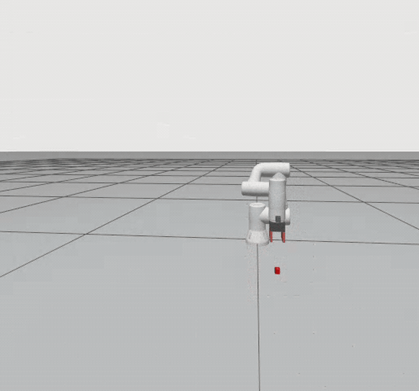

# JAKA ZU3 ROS 2 Visual Grasping Simulation

## Demo

<p align="center">
  
</p>

<p align="center">
  <b>Vision-guided round-trip pick-and-place demo</b>
</p>

<p align="center">
  ROS 2 · MoveIt 2 · Gazebo · RGB-D Vision · Autonomous Grasping
</p>

The animation shows the complete vision-guided pick-and-place cycle.
The original recording is also available as a
[WebM video](docs/media/JAKA_ZU3_grasp.webm) (GitHub may download it or show
"View raw" instead of playing it in the browser).

## 1. Overview

This project implements a complete simulation-only visual pick-and-place
pipeline for the JAKA ZU3 collaborative robot. A wrist-mounted RGB-D camera
detects a red object, estimates its top-surface position in the `world` frame,
and triggers a guarded top-down grasp and placement sequence.

The demo integrates ROS 2, Gazebo Sim, `ros2_control`, MoveIt 2, TF2 and OpenCV.
Arm poses are planned through the MoveGroup action with Pilz PTP/LIN planners;
the grasp sequence itself is coordinated by a custom ROS 2 state machine.

> **Project status:** The complete pipeline has been validated in simulation.
> A real JAKA robot and physical gripper have not yet been connected or tested.

## 2. Environment

- Ubuntu 22.04
- ROS 2 Humble
- Gazebo Fortress / Gazebo Sim 6 (`ros_gz`)
- MoveIt 2 with the Pilz industrial motion planner
- `ros2_control`
- OpenCV and `cv_bridge`
- Python 3

## 3. Features

### 3.1 Robot Simulation

- JAKA ZU3 robot URDF/Xacro description
- Robot model visualization in Gazebo
- Joint state publishing
- Robot motion control through ROS 2

### 3.2 MoveIt 2 Integration

- Motion planning through the MoveGroup action
- Pilz PTP motion for joint/pre-grasp moves and LIN motion for vertical moves
- Robot arm trajectory execution
- Joint-space observation pose and Cartesian end-effector goals

### 3.3 RGB-D Camera Integration

- Wrist-mounted RGB-D camera model
- RGB image and depth image publishing
- 3D deprojection followed by camera-to-world transformation using TF2

### 3.4 Guarded Visual Picking

- Timestamp-matched RGB and depth frames
- Red-object segmentation with robust median depth estimation
- Stable-target filtering and configurable workspace limits
- Height-aware grasp poses for small and tall objects
- Custom guarded state machine for approach, grasp, lift, place, release,
  retreat and return
- Optional finite shuttle cycles between the destination and detected source
- Symmetric two-finger commands with joint-position synchronization checks
- Gazebo-only object attachment after a confirmed close, so the simulated
  object follows the gripper during lift instead of relying on contact
  friction alone

## 4. Build

After installing ROS 2 Humble and configuring `rosdep`, clone the repository
as a ROS 2 workspace:

```bash
git clone https://github.com/Deamon-l/jaka_zu3_ros2_gazebo.git ~/jaka_ws
cd ~/jaka_ws
```

Install the declared dependencies, then build only the packages needed by the
visual grasping demo:

```bash
cd ~/jaka_ws
source /opt/ros/humble/setup.bash
rosdep install --from-paths src --ignore-src -r -y
colcon build --symlink-install --packages-up-to jaka_zu3_moveit_config
source install/setup.bash
```

Run the build command again after changing a URDF/Xacro, SDF, launch, Python or
YAML source file. Python edits are reflected directly when the workspace was
built with `--symlink-install`, but rebuilding after a mixed configuration
change is the safest workflow.

## 5. Run the demo

Every new terminal must source both ROS 2 and this workspace first:

```bash
cd ~/jaka_ws
source /opt/ros/humble/setup.bash
source install/setup.bash
```

Run the round-trip demo shown in the GIF (source to destination, then back to
the detected source position):

```bash
ros2 launch jaka_zu3_moveit_config demo_gazebo.launch.py \
  enable_camera:=true run_grasp:=true execute_grasp:=true \
  transfer_cycles:=2 place_x:=0.35 place_y:=-0.15 place_z:=0.02
```

To perform only one source-to-destination transfer:

```bash
ros2 launch jaka_zu3_moveit_config demo_gazebo.launch.py \
  enable_camera:=true run_grasp:=true execute_grasp:=true \
  transfer_cycles:=1
```

An optional plan-only check plans the fixed observation pose without moving
the robot. It does not validate the complete grasp trajectory:

```bash
ros2 launch jaka_zu3_moveit_config demo_gazebo.launch.py \
  enable_camera:=true run_grasp:=true execute_grasp:=false
```

For a server-only run, append `headless:=true use_rviz:=false`. Motion is
disabled by default and is enabled only when `execute_grasp:=true` is passed.

The default destination is `(0.35, -0.15, 0.02)` in `world`. Here, `place_z`
means the object's top-surface height rather than its center height.

## 6. Target object and configuration

The red target is an independent dynamic model in
`src/jaka_zu3_moveit_config/config/jaka_rgbd_world.sdf`; it is not a robot link.
Its current size is 20 mm and its initial center pose is
`(0.32, 0.08, 0.01)` in `world`. The motion node does not use that hard-coded
pose for grasping: it waits for stable RGB-D detections published in the
`world` frame. The object can therefore be moved within the camera field of
view, robot workspace and configured safety bounds.

Detection and grasp tuning parameters are kept in
`src/jaka_zu3_vision/config/vision_grasp.yaml`. The camera mounting transform
and the camera-to-optical-frame transform are not altered by this file. The
most commonly adjusted values are:

- `min_area`, `max_area`, `min_depth`, and `max_depth` for detection
- `object_height_threshold`, `small_object_gripper_base_z`, and
  `large_object_top_offset_z` for height-aware grasping
- `approach_offset_z`, `lift_offset_z`, and `place_approach_offset_z` for motion
- `place_x`, `place_y`, and `place_z` for placement
- `transfer_cycles` and `repeat_delay` for finite shuttle operation
- `open_width` and `closed_width` for the inward-moving finger joints
- `finger_sync_tolerance` and `finger_goal_tolerance` for close verification
- `gripper_sync_timeout` and `gripper_close_attempts` for a bounded
  reopen/reclose retry before lifting
- `workspace_min_*` and `workspace_max_*` for target safety limits

Both prismatic joints receive equal positions in a single gripper trajectory.
Their opposite axes move both fingers inward. Before attaching or lifting,
the motion node checks fresh measured feedback from each finger (within
1 mm of each other and 2 mm of the closed target); missing or stalled feedback
causes a reopen/reclose retry at grasp height, then stops if it still fails.
The finger model's lower joint limits are -1 mm while commanded opening stays
at 0 mm. This small margin keeps the initial open pose off the physics hard
stop, which otherwise pins the left finger on the first close in Gazebo.
The visible fingers remain 40 mm tall, while their collision geometry is
slightly shorter to prevent ground contact from blocking lateral closure.
During the Gazebo demo, `use_sim_attachment` is
enabled by the launch file only when
`run_grasp:=true`; it is a simulation aid and is not part of real-robot grasp
control.

The detector publishes `/detected_target_point` and
`/detected_target_marker`. A pick starts only after the configured number of
fresh detections agree within `target_stability_tolerance`.

## 7. Implementation notes and limitations

- The detector is currently designed for one red object and uses HSV
  segmentation plus median depth, not a learned object detector.
- Grasping is top-down and assumes an upright object resting on the ground.
- The initial observation pose is fixed, so a relocated object must remain
  visible and reachable.
- Gazebo object attachment is a simulation aid used after verified finger
  closure; it is not real gripper control or a physics-only grasp benchmark.
- The complete workflow has not yet been validated on a physical robot.
